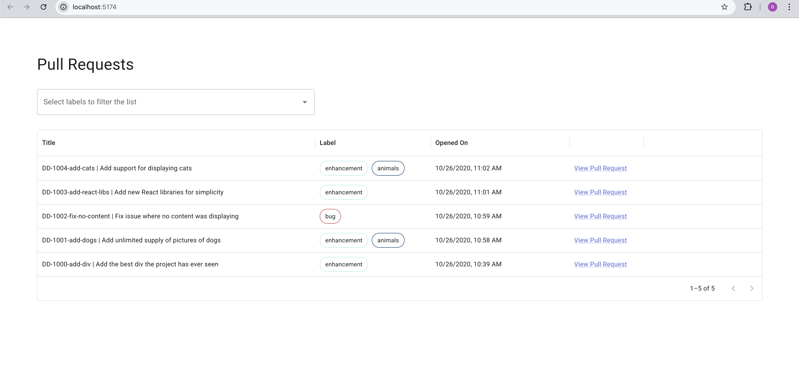

# UI Coding Challenge

Uses [Vite](https://vitejs.dev/), [Vitest](https://vitest.dev/), and [React Testing Library](https://github.com/testing-library/react-testing-library) to create a modern [React](https://react.dev/) app compatible with [Create React App](https://create-react-app.dev/)

This project uses MUI, Redux Toolkit, Vite, React (TypeScript), and other goodies.

## To clone the repo

`git clone https://github.com/rafiwardak2003/ui-coding-challenge.git`

## How to run locally

In your terminal, run the following commands:

- `yarn`
- `yarn dev`

## How to run tests:

- `yarn`
- `yarn test`

## How to run the prod build locally:

This will build the project as you would for production and preview locally:

- `yarn`
- `yarn build`
- `yarn preview`

Note: To deploy this on the cloud (Azure, AWS), please use a static service like AWS S3/Cloudfront or Azure Static Web App.
They are cheaper and they just serve static files. Deploy only the `dist` folder. We do not need to use any
complicated deployments like Docker for modern Single Page Apps like React, because they are static files and 
a static file service generally works the best because they are highly available by default and cache the files.

